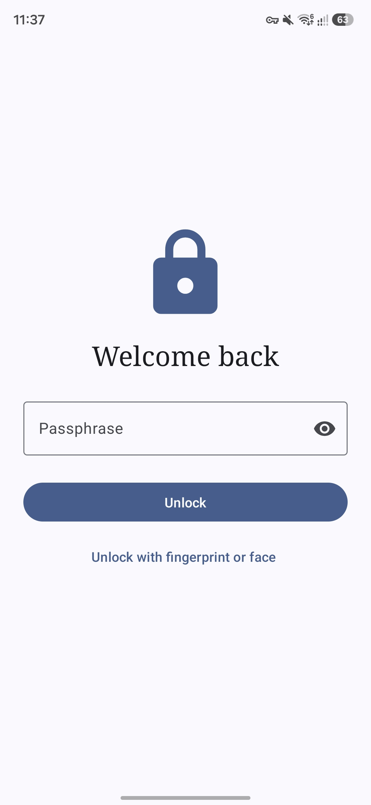
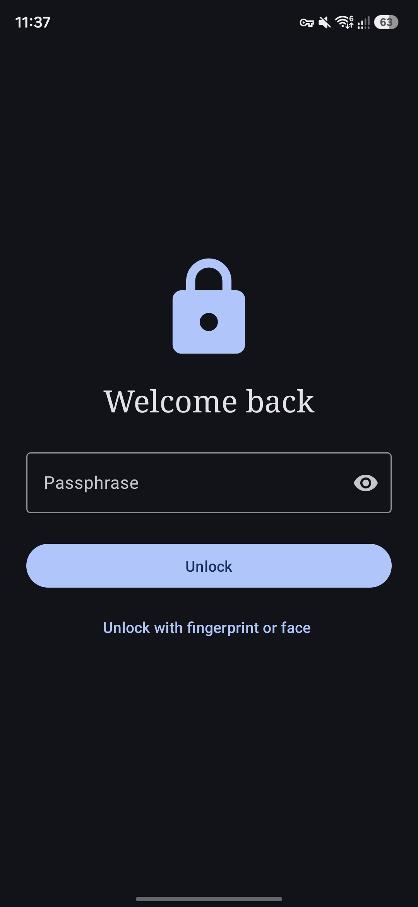
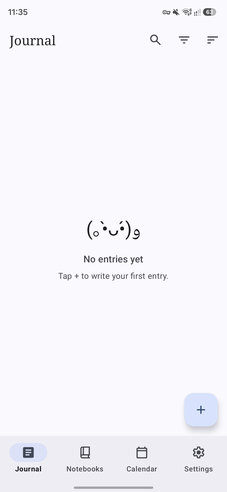
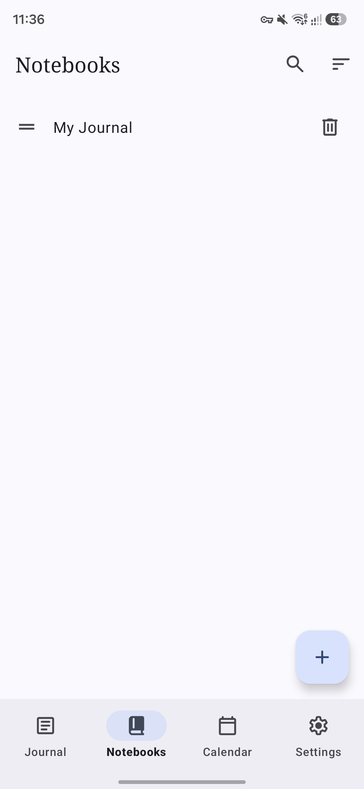
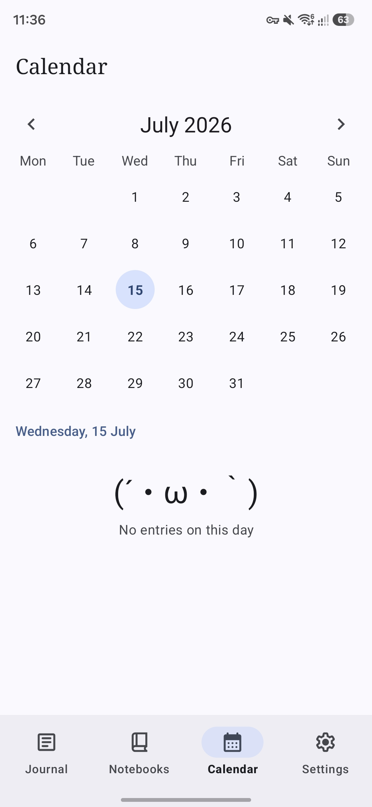
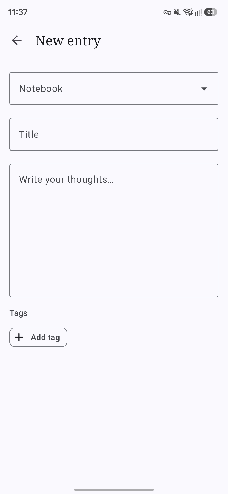

<div align="center">


# Dearest

**Your diary. Your device. Nobody else's.**

Dearest is a simple, open-source diary and journaling app built to be fully private and fully offline. Every entry is encrypted on your device with a passphrase only you know — there's no account, no server, and no way for anyone (including the developer) to read your journal.

</div>

## Features

* **Free and Open Source:** Enjoy complete transparency and community-driven development.
* **Encrypted at Rest:** Your entire journal is encrypted with AES-256 (via SQLCipher), keyed by a passphrase only you know.
* **No Recovery, By Design:** There is no account, no password reset, and no backdoor. Your passphrase is the only key — that's what makes the privacy guarantee real, not just a policy.
* **Optional Biometric Unlock:** Unlock with fingerprint or face as a convenience layer on top of your passphrase, which always remains the master credential and always works as a fallback.
* **Fully Offline:** Dearest requests no internet permission at all — it is architecturally incapable of sending your data anywhere. You can verify this yourself in your system's app settings.
* **App Lock:** Configurable auto-lock timeout, a privacy screen that covers your journal the instant you switch away — before the app-switcher animation even plays — screenshot/screen-recording blocked on every screen, and an escalating delay after repeated failed passphrase attempts.
* **Appearance:** Choose System, Light, or Dark theme; boost contrast for readability; and opt into Material You dynamic color that matches your device's wallpaper.
* **Notebooks:** Organize entries into separate diaries — personal, work, dreams, whatever suits you — each with an optional description. Deleting a notebook never silently loses entries; you're always asked to move them first.
* **Tags:** Freeform, multi-select labels that cut across notebooks, for the themes that don't fit neatly into one diary.
* **Search, Filter & Sort:** Full-text search composed with notebook and tag filtering, plus sorting by newest, oldest, or title.
* **Calendar View:** See at a glance which days you've written on, and jump straight to any day's entries.
* **Daily Reminder:** An optional nudge at a time you choose, to help the habit stick.
* **Backup & Export, Your Way:** Create a self-contained encrypted backup protected by a password you choose, or export your entries as plain text, CSV, or JSON if you'd rather own a portable, readable copy.
* **Crash Reports:** If the app encounters an unexpected error, a dialog on the next launch lets you copy the technical details to your clipboard or save them to a file — nothing from your journal is ever included, and nothing is sent automatically.

## Screenshots

<div align="center">
	<div>
	  
    
    
	  
    
    
	</div>
</div>

## Verification

APK releases on GitHub are signed using my key. They can
be verified using
[apksigner](https://developer.android.com/studio/command-line/apksigner.html#options-verify):

```
apksigner verify --print-certs --verbose dearest.apk
```

The output should look like:

```
Verifies
Verified using v1 scheme (JAR signing): false
Verified using v2 scheme (APK Signature Scheme v2): true
Verified using v3 scheme (APK Signature Scheme v3): false
Verified using v3.1 scheme (APK Signature Scheme v3.1): false
Verified using v3.2 scheme (APK Signature Scheme v3.2): false
Verified using v4 scheme (APK Signature Scheme v4): false
```

The certificate fingerprints should correspond to the ones listed below:

```
Owner: CN=Mowtiie
Issuer: CN=Mowtiie
Serial number: 8a256fdcdde50069
Valid from: Wed Jun 10 22:57:23 PST 2026 until: Sun Oct 26 22:57:23 PST 2053
Certificate fingerprints:
         SHA1: 56:4E:2C:DB:E4:06:C9:EC:15:E6:BC:D9:0A:88:38:72:8B:FB:13:20
         SHA256: 8B:67:51:F3:C3:31:85:63:5F:98:95:30:B6:C0:73:A1:39:7B:3D:41:2B:EF:AE:69:06:A2:EB:58:45:D2:DE:63
```

**Warning:** Only install Dearest APKs signed with the key above. Verifying the signature confirms you're running a genuine, unmodified build.

### PGP Signing

As an additional layer on top of the Android signature above, each release is also signed with my PGP key. While `apksigner` confirms the APK itself is intact, a PGP signature confirms that *I* am the one who published this specific file to GitHub — an independent check that doesn't rely on GitHub's account security alone.

**Public key fingerprint:**
```
9EA2 8F46 7802 5092 7643 1B69 42B5 FA42 AA63 90E1
```

Download and import the key from my website, or directly from this repo:

```
curl -O https://mowtiie.cc/PGP_PUBLIC_KEY.asc
gpg --import PGP_PUBLIC_KEY.asc
```

After importing, confirm the fingerprint printed by GPG matches the one listed above — that match is what actually establishes trust, not the import step itself. Fetching the key over HTTPS from a domain you already trust is arguably a stronger anchor than a keyserver, since keyservers accept uploads from anyone and don't vouch for identity.

Each release includes a detached `.asc` signature alongside the APK. Verify a downloaded release with:

```
gpg --verify dearest-vX.X.apk.asc dearest-vX.X.apk
```

A valid signature looks like:

```
Good signature from "Mowtiie <mowtiie.dev@gmail.com>"
```

**Note:** PGP signing is a supplementary trust measure, not a substitute for the `apksigner` check above — verify both if you want the highest confidence that a release is genuine and unmodified.

## Mapping Files

Each release on GitHub includes a `mapping-<version>.txt` file alongside the APK. This file is needed to deobfuscate stack traces from crash reports — match the file to the version shown in the crash report header and use it with `retrace` from the Android SDK.

## Contributing

Issues and pull requests are welcome. If you're filing a bug, please include your Android version and the steps to reproduce.

## License

This project is licensed under the GNU General Public License v3.0. See the
[LICENSE](LICENSE) file for details.
